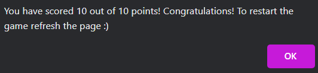

# PORTFOLIO PROJECT 2

# Geography Quiz

## SITE PURPOSE

This Geography Quiz offers 10 questions for the user to test their knowledge on Geography.
It informs the user of general rules, features clickable buttons and alerts the user of the points scored.
[Here is a link to the final project](https://runabrandes.github.io/project-2/)

## FINAL DESIGN

 [Am I Responsive](https://amiresponsive.co.uk/)

## PROJECT IDEA

My idea for Project 2 stems from my interest in Geography and travelling. I wanted to create a fun and easy to understand quiz that focuses on facts from around the globe.

The features I wanted the game to have are:

- Quiz navigations and controls are easy to understand
- Simple but nice to look at design that fits the topic of the quiz
- Website gives feedback dependig on user input

#

## UX/UI

- The quiz is simple and fun for users of different age groups
- The quiz and navigations are explained so the user can play the game without any troubles
- The page has been designed so it is easy to read (no visual disturbance by the background image)
- The background image used is of good quality and fits the page content

## SITE GOALS

- To make the site accessible
- Providing users with an easy to read and navigate website
- Providing users with information of how to navigate the game and make it easy to understand

#

## WIREFRAMES

- Wireframes for mobile and desktop:

Wireframes for Start Page

Wireframes for Quiz Page

#

## WEBSITE FEATURES

- The website consists of 1 page which features a Start page and the actual Quiz, which can be reached by pressing a "Start" button.

- Start page

  - The Start page features a header ("Geography Quiz") and a Start button as well as a text section which explains the rules of the quiz.
    

- Quiz

  - Once the "Start" button has been clicked the Quiz page will be displayed. This features a question area as well as four answer buttons and a "Next" button.
    When an answer button is clicked the user will be notified if the answer selected was right or wrong, the score will be updated accordingly and the user will be prompted to click the "Next" button to continue to the next question.

  

- Header

  

- Question Area

  

- Score Alert

  

- Game End Alert

  

#

## DESIGN

- COLOUR SCHEME

  - The header features a dark-blue background with a white font and two icons.
  - The overall background is an image featuring maps of different areas of the world, which is fitting for the topic of Geography.
    The backup for the background is a dark grey colour to ensure that the white font, which has been used for the entirety of the website, will still be visible even if the background image should not load.
  - The Quiz Area has a grey background which is slightly opaque so the background image will still be visible to the user but the visibility of the question area will not be disturbed.
  - The buttons are white with black text to ensure good readability of the text.

  - All used colours with their rgb codes can be found below:
  -  rgb(0, 0, 139)
  -  rgb(255, 255, 255)
  -  rgb(44, 50, 56)
  -  rgb(70, 70, 70)

- TYPOGRAPHY

  - The fonts used are "Rubik Doodle Shadow" and "Exo 2".
  - "Rubik Doodle Shadow" was used for the header of the website.
  - "Exo 2" was used for the rest of the website.
  - The backup font for the entire website is sans-serif.
  - "Rubik Doodle Shadow" and "Exo 2" were imported from Google Fonts.

- MEDIA
  - Only one image has been used for this website which has been sourced from [pexels.com](https://www.pexels.com/).
    This is the background image for the body of the page that features maps of different regions of the world.
  - The FAVICON for the website has been taken from [icons8.com](https://icons8.com/icon/w_qRMJOKoZGs/globe-showing-europe-africa).

#

## TESTING

### VALIDATORS

- HTML
  - I have checked my HTML using the [W3C HTML Validator](https://validator.w3.org/#validate_by_input).
  - I have had no errors come up but one warning which has informed me that the game section does not have a header and if no header is needed, it would be better practice to change this to a div. I have since changed the section to a div and the testing has passed without errors or warnings afterwards.
  - There were a few "Info" messages showing, stating "Trailing slash on void elements has no effect and interacts badly with unquoted attribute values.", which is due to the Prettier extension in CodeAnywhere being used.

- CSS
  - I have checked my style.css file with the [W3C CSS Validator](https://jigsaw.w3.org/css-validator/) and was given no errors. There was one warning message regarding the imported style sheets from Google Fonts stating "Imported style sheets are not checked in direct input and file upload modes". This cannot be changed as it is an external file from Google Fonts.

- JavaScript
  - The script.js file was tested using [JSHint.com](https://jshint.com/).
    The testing showed several warnings but no errors.
    Warnings were revolvong around "ES6 (use 'esversion: 6') or Mozilla JS extensions" and "using dot notation".

### ACCESSIBILITY

My website has been tested for accessibility using the WAVE - Web Accessibility Evaluation Tool.
The report can be viewed [here](https://wave.webaim.org/report#/https://runabrandes.github.io/project-2/)

### LIGHTHOUSE

- Lighthouse testing was carried out successfully for the page. Please see below for the outcome:

### DEVICES

I have tested responsiveness and functionality on the following devices and browsers:

- Android:

  - Galaxy Tab 7

- Apple:

  - iPad mini
  - iPhone 14 Pro Max

- Desktops/laptops:

  - HP Pavilion Laptop
  - MacBook Air 2023

- Browsers:

  - Chrome
  - Safari

### FUNCTIONALITY OF WEBSITE

- The quiz is working as intended with clickable Start, Next and answer buttons
- Score is incrementing according to correct answers given
- Correct alerts are showing depending on if answer was correct or wrong
- Background image loaded on all tested devices

### SOLVED / UNSOLVED BUGS AND ERRORS

My website has not shown any errors whilst testing was carried out. I only had one warning message during HTML testing. The warning and the fix can be found in the "Testing - Validators" section of this README document.

#

## TECHNOLOGIES USED

- [HTML](https://en.wikipedia.org/wiki/HTML5)
- [CSS](https://en.wikipedia.org/wiki/CSS#CSS_3)
- [JavaScript](https://en.wikipedia.org/wiki/JavaScript)

#

## PROGRAMS USED

- GitHub
- CodeAnywhere
- Font Awesome
- Google Fonts
- Chrome Developer Tools
- Balsamiq Wireframes
- Am I Responsive
- W3C HTML Validator
- W3C CSS Validator
- JSHint
- WAVE

#

## DEPLOYMENT

"Geography Quiz" was deployed using GitHub. A link to the live version can be found at the top of this README file.

1. Click on the "Settings" icon at the top of page in the navigation bar of the relevant repository.
2. Select "Pages" which can be found on the left hand side of the GitHub website.
3. In the dropdown menu for Source, select "Deploy from a branch".
4. In the "Branch" dropdown menu, select "main" for the first selection, and "root" for the second selection.
5. Click "Save".
6. After refreshing the page, a link to the live website will be available.

#

## CREDITS

- Google Fonts - for sourcing and importing all fonts for my website
- Font Awesome - for the icons used for the header
- W3schools - for tips and tricks on coding techniques
- Stack overflow - for more tips and tricks
- Slack community - for aiding with some coding issues
- The Code Institute Tutoring Team - for helping me with JavaScript code I was unable to solve (marked in scipt.js file)
- YouTube - for different videos on JavaScript functions that gave me a starting idea on how to develop this quiz
  - [First video used](https://www.youtube.com/watch?v=riDzcEQbX6k&t=1453s)
  - [Second video used](https://www.youtube.com/watch?v=PBcqGxrr9g8&t=1052s)

#

## ACKNOWLEDGEMENTS

- My husband Jamie who has taken the time to look at my project and has given me advice.
- My mentor Rory for taking his time helping and guiding me in the right direction with his feedback and suggestions. Thank you for your support and help!